# Nexus Store

Dự án cuối kì môn **Phát triển Ứng dụng Web 2** — MSSV: 65133147

---

## 1. Mô tả ứng dụng

Nexus Store là một ứng dụng thương mại điện tử xây dựng bằng **Spring Boot** và **Thymeleaf**. Ứng dụng mô phỏng các chức năng cơ bản của cửa hàng trực tuyến: duyệt sản phẩm, giỏ hàng, thanh toán đơn hàng, gửi email xác nhận, và trang quản trị dành cho Admin.

---

## 2. Điểm nổi bật

- Hệ thống phân quyền Admin / Customer (session-based).
- Quản lý sản phẩm, danh mục, đơn hàng đầy đủ CRUD.
- Giỏ hàng và checkout (chọn màu sắc sản phẩm).
- **Gửi email tự động (async)** xác nhận đơn hàng khi đặt hàng và khi đơn hoàn tất.
- Tìm kiếm sản phẩm trả về JSON (`/api/search`).
- Template engine: Thymeleaf (server-side rendering).

---

## 3. Công nghệ sử dụng

| Thành phần | Phiên bản / Ghi chú |
|---|---|
| Java | 17 |
| Spring Boot | 4.0.6 |
| Spring Data JPA | Hibernate |
| Spring Security | Session-based |
| Spring Mail | Gmail SMTP + `@Async` |
| Thymeleaf | + `thymeleaf-extras-springsecurity6` |
| MySQL | Production DB |
| H2 | Runtime / dev console |
| Lombok | Compile-time |
| Maven | Wrapper `mvnw` |

---

## 4. Các chức năng chính

### Người dùng (Customer)
- Đăng ký / đăng nhập / đăng xuất
- Xem trang chủ, danh sách sản phẩm, chi tiết sản phẩm
- Tìm kiếm sản phẩm: `GET /api/search?q=...`
- Quản lý giỏ hàng: thêm, cập nhật số lượng, xóa sản phẩm
- Thanh toán (tạo đơn hàng) — nhận email xác nhận ngay sau khi đặt
- Quản lý hồ sơ (profile) và thông tin thanh toán

### Quản trị (Admin)
- Giao diện quản trị: `/admin`
- Quản lý người dùng: xem, tạo, sửa, xóa
- Quản lý sản phẩm & danh mục: xem, tạo, sửa, xóa, lọc
- Quản lý đơn hàng: xem, cập nhật trạng thái, xóa
- Khi admin chuyển đơn hàng sang trạng thái **Completed** → hệ thống tự động gửi email thông báo đến khách hàng

---

## 5. Ảnh minh họa giao diện

### Trang khách hàng (Customer)

**Trang chủ**
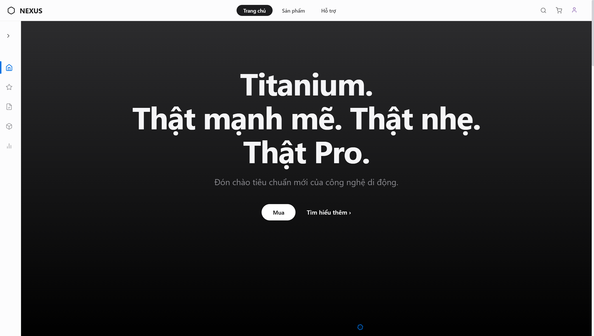

**Sản phẩm nổi bật**
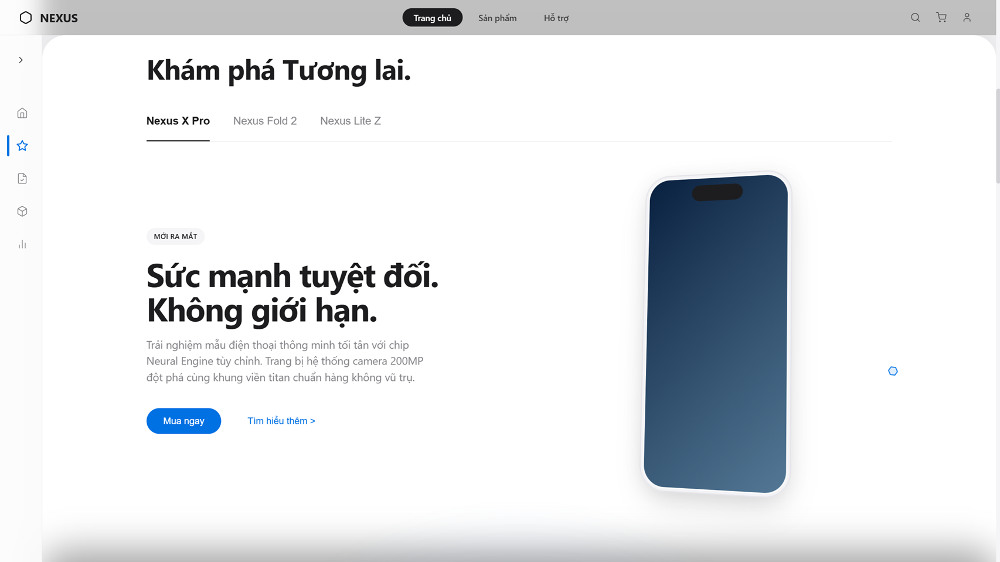

**Danh sách sản phẩm, tìm kiếm & lọc theo danh mục**
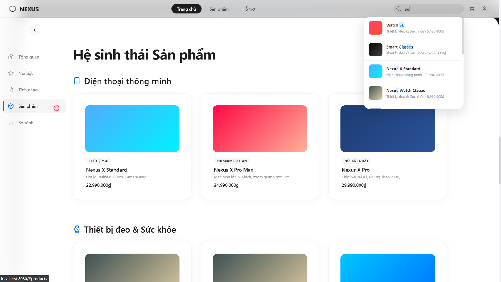

**Trang danh sách sản phẩm**
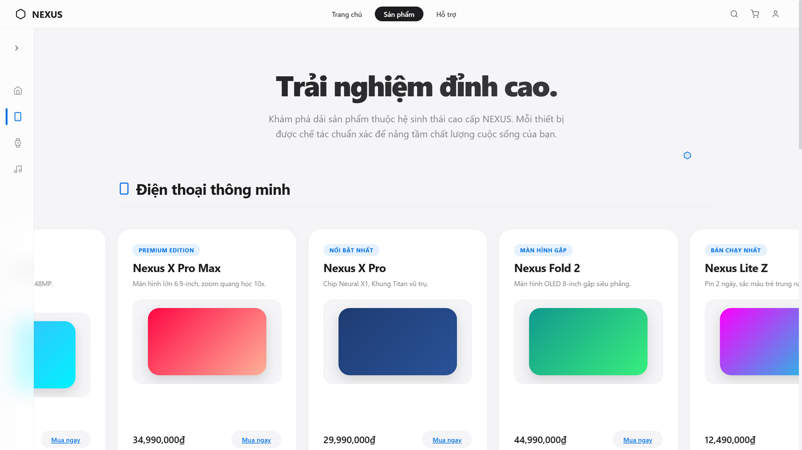

**Chi tiết sản phẩm**
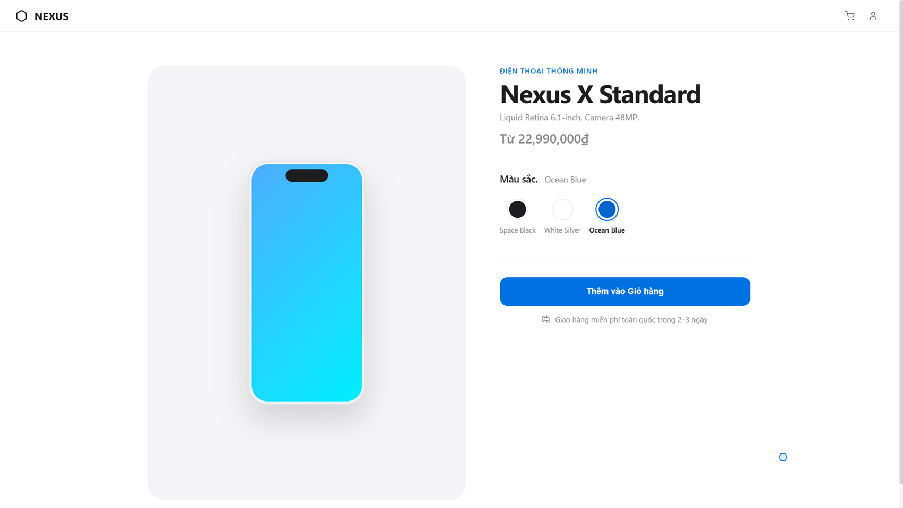

**Giỏ hàng**
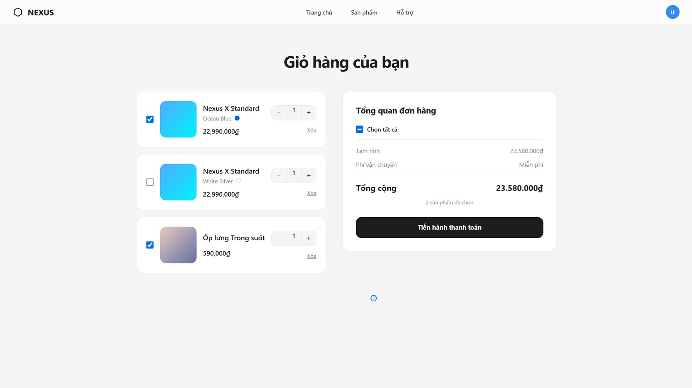

**Thanh toán / Đặt hàng**
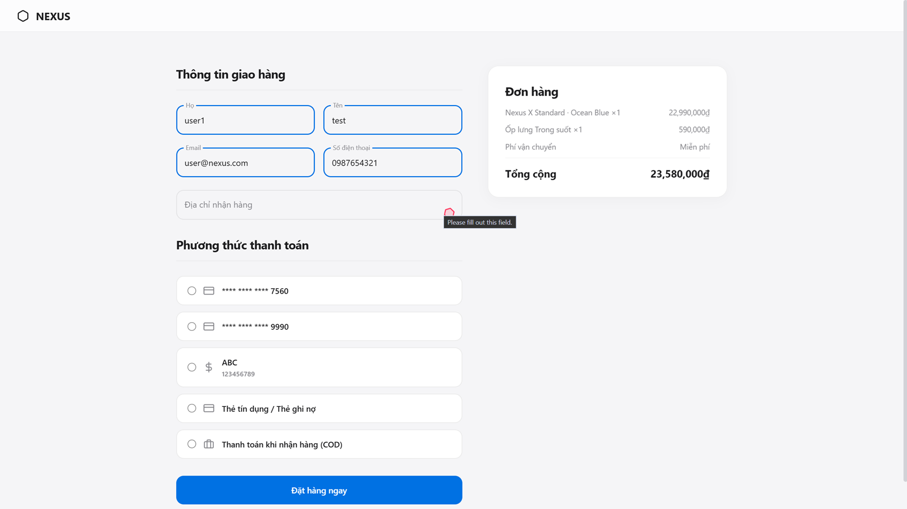

**Hồ sơ người dùng**
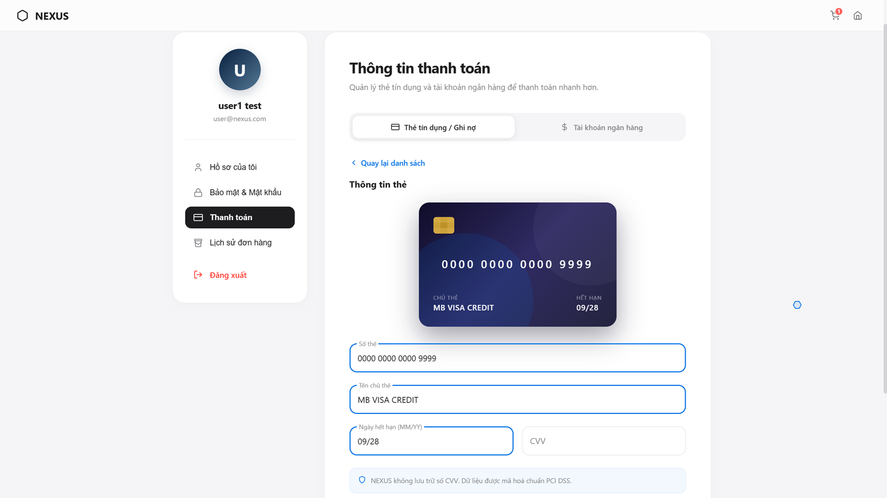

**Trang hỗ trợ**
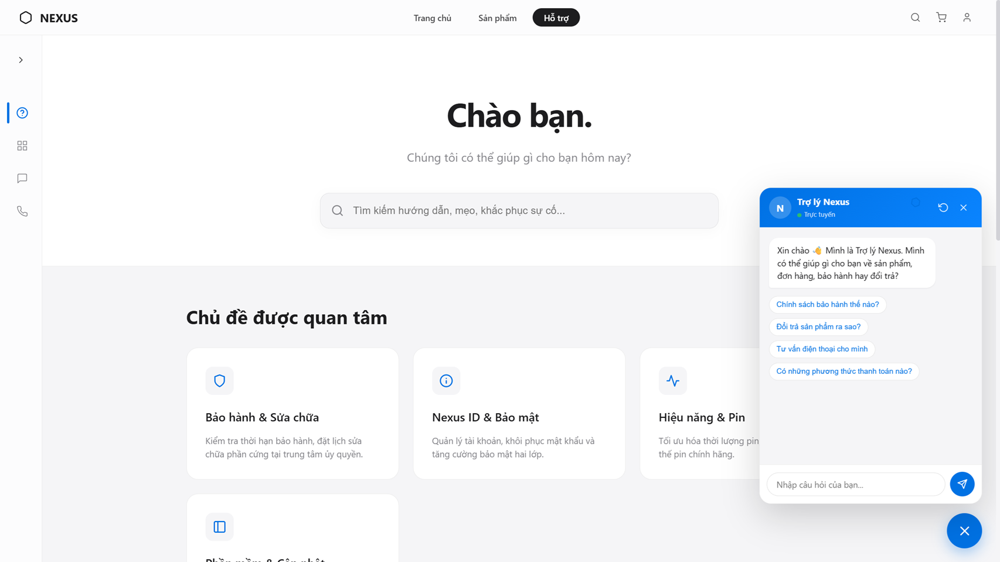

### Trang quản trị (Admin)

**Quản lý sản phẩm**
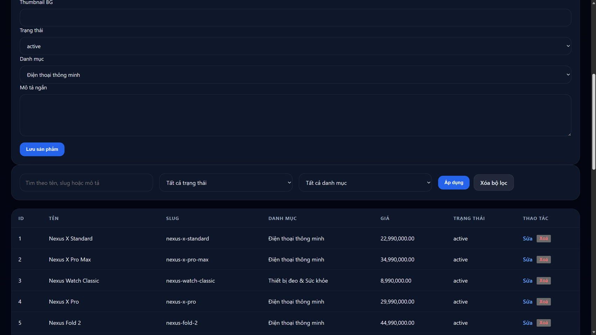

**Quản lý danh mục**
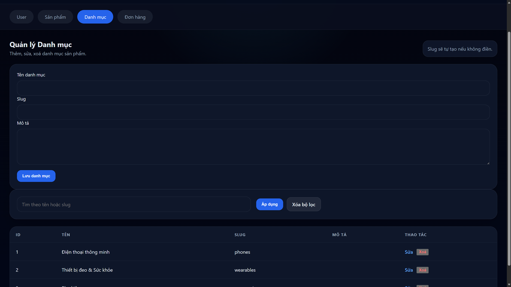

**Quản lý đơn hàng**
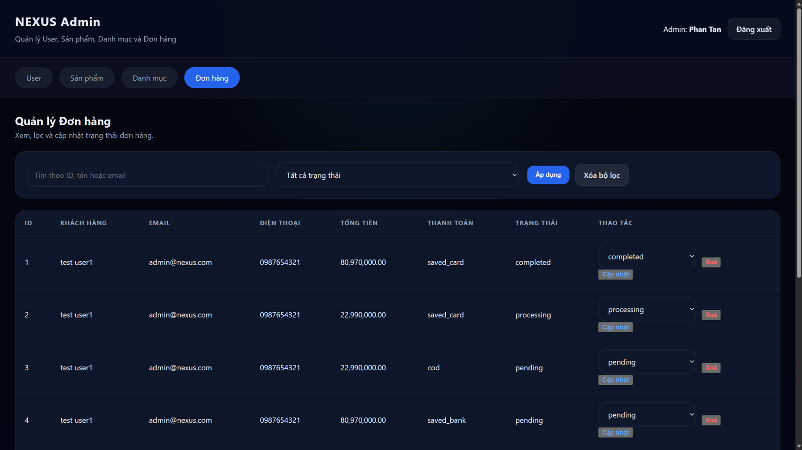

**Quản lý người dùng**
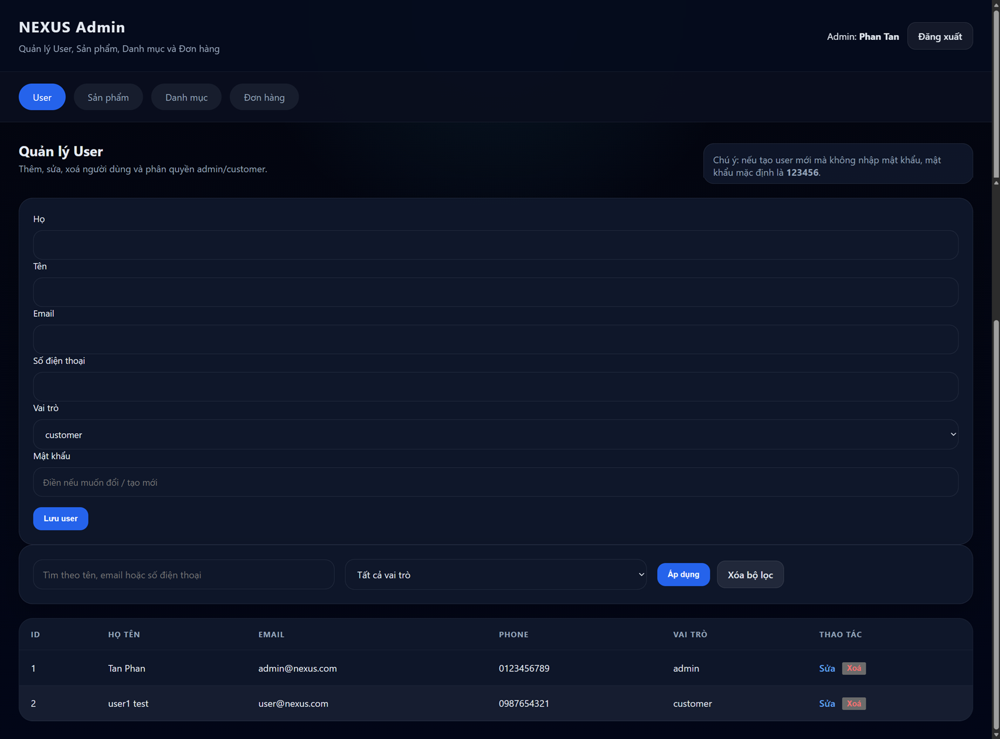

---

## 6. Kiến trúc tổng quan

Ứng dụng theo mô hình phân tầng **MVC + Service + Repository**.

```
Browser / Client
    ↓ HTTP
Presentation (Thymeleaf templates)
    ↓
Spring Security (session filter)
    ↓
Controllers
  ├── HomeController
  ├── ProductController
  ├── CartController
  ├── AuthController
  └── AdminController
    ↓
Services
  ├── OrderService      — tạo đơn hàng, gọi EmailService
  ├── CartService
  ├── UserService
  ├── PaymentService
  └── EmailService      — gửi email async (Gmail SMTP)
    ↓
Repositories (Spring Data JPA)
    ↓
MySQL Database
```

---

## 7. Cấu trúc thư mục chính

```
src/
├── main/
│   ├── java/
│   │   └── thicuoiki2/phannhattan/com/nexus/store/
│   │       ├── Cuoiki265133147Web2NexusStoreApplication.java
│   │       ├── config/         # SecurityConfig
│   │       ├── controller/     # HomeController, ProductController, CartController, AuthController, AdminController
│   │       ├── entity/         # Order, OrderItem, Product, ProductColor, Category, User, CartItem
│   │       ├── repository/     # Spring Data JPA repositories
│   │       └── service/        # OrderService, CartService, UserService, PaymentService, EmailService
│   └── resources/
│       ├── templates/          # Thymeleaf views
│       ├── static/             # css, js, images
│       └── application.properties
```

---

## 8. Yêu cầu (Prerequisites)

- Java 17+ JDK
- Maven hoặc dùng wrapper `mvnw`
- MySQL server đang chạy
- Tài khoản Gmail với **App Password** (cho chức năng gửi email)

---

## 9. Quick Start — Chạy nhanh dự án (Local)

**1. Clone repository**
```bash
git clone https://github.com/Koe495/phat_trien_ung_dung_web_2.git
cd cuoiki2-65133147-web2-nexus-store
```

**2. Tạo database MySQL**
```sql
CREATE DATABASE nexus_db CHARACTER SET utf8mb4 COLLATE utf8mb4_unicode_ci;
```
Nếu repo có file `nexusdb.sql`, import vào:
```bash
mysql -u root -p nexus_db < nexusdb.sql
```

**3. Cấu hình `application.properties`**
```properties
spring.datasource.url=jdbc:mysql://localhost:3306/nexus_db?useSSL=false&serverTimezone=UTC&characterEncoding=UTF-8
spring.datasource.username=root
spring.datasource.password=your_password

spring.mail.host=smtp.gmail.com
spring.mail.port=587
spring.mail.username=your_gmail@gmail.com
spring.mail.password=your_app_password
spring.mail.properties.mail.smtp.auth=true
spring.mail.properties.mail.smtp.starttls.enable=true
spring.mail.from=your_gmail@gmail.com
```

**4. Chạy ứng dụng**

Windows:
```bash
.\mvnw.cmd -DskipTests spring-boot:run
```
Unix / macOS:
```bash
./mvnw -DskipTests spring-boot:run
```

**5. Mở trình duyệt:** `http://localhost:8080`

---

## 10. Tài khoản mặc định

| Role | Tạo qua |
|---|---|
| Admin | Seed SQL hoặc tạo thủ công trong DB (role = `admin`) |
| Customer | Đăng ký qua `/register` |

---

## 11. Endpoints chính

**Public / Customer**

| Method | Endpoint | Mô tả |
|---|---|---|
| GET | `/` | Trang chủ |
| GET | `/products` | Danh sách sản phẩm |
| GET | `/product/{slug}` | Chi tiết sản phẩm |
| GET | `/cart` | Giỏ hàng |
| POST | `/cart/add` | Thêm vào giỏ |
| POST | `/cart/update` | Cập nhật số lượng |
| POST | `/cart/remove` | Xóa sản phẩm khỏi giỏ |
| GET | `/checkout` | Trang thanh toán |
| POST | `/checkout/place-order` | Đặt hàng |
| GET/POST | `/register` | Đăng ký |
| GET/POST | `/login` | Đăng nhập |
| GET | `/api/search?q=...` | Tìm kiếm sản phẩm (JSON) |

**Admin**

| Method | Endpoint | Mô tả |
|---|---|---|
| GET | `/admin` | Trang quản trị |
| POST | `/admin/products/save` | Lưu sản phẩm |
| POST | `/admin/products/delete` | Xóa sản phẩm |
| POST | `/admin/categories/save` | Lưu danh mục |
| POST | `/admin/categories/delete` | Xóa danh mục |
| POST | `/admin/users/save` | Lưu người dùng |
| POST | `/admin/users/delete` | Xóa người dùng |
| POST | `/admin/orders/update-status` | Cập nhật trạng thái đơn hàng |
| POST | `/admin/orders/delete` | Xóa đơn hàng |

---

## 12. Cấu hình email (Gmail SMTP)

Tính năng gửi email hoạt động **bất đồng bộ** (`@Async`) để không làm chậm luồng chính.

- **Khi đặt hàng thành công** → gửi email xác nhận đến `shippingEmail`.
- **Khi admin đổi trạng thái sang `completed`** → gửi email thông báo hoàn tất.

Yêu cầu Gmail: bật **2-Factor Authentication** và tạo **App Password** tại [myaccount.google.com/apppasswords](https://myaccount.google.com/apppasswords). Dán App Password vào `spring.mail.password`.

---

## 13. Troubleshooting

| Lỗi | Nguyên nhân thường gặp | Cách xử lý |
|---|---|---|
| Không kết nối được DB | Sai URL / password / MySQL chưa chạy | Kiểm tra `application.properties` và MySQL service |
| Port 8080 bị chiếm | Có process khác đang dùng | Đổi `server.port` |
| Không gửi được email | Sai App Password hoặc chưa bật SMTP | Kiểm tra `spring.mail.*`, tạo lại App Password |
| Schema lỗi khi khởi động | `ddl-auto` conflict | Dùng `update` khi dev, import lại SQL nếu cần |

---

## 14. Lưu ý bảo mật (Production)

- Không commit `application.properties` chứa password lên Git — dùng biến môi trường.
- Đổi `spring.jpa.hibernate.ddl-auto` sang `validate` cho môi trường production.
- Bật CSRF, HTTPS, và kiểm tra session fixation trước khi deploy thật.

---

## 15. Tác giả

- **Phan Nhật Tấn** — MSSV: 65133147
- GitHub: [Koe495](https://github.com/Koe495)
